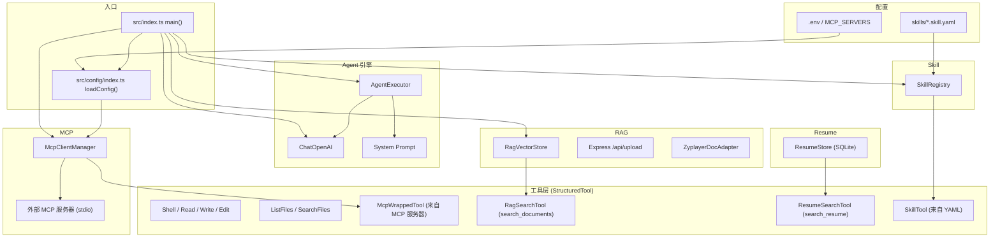
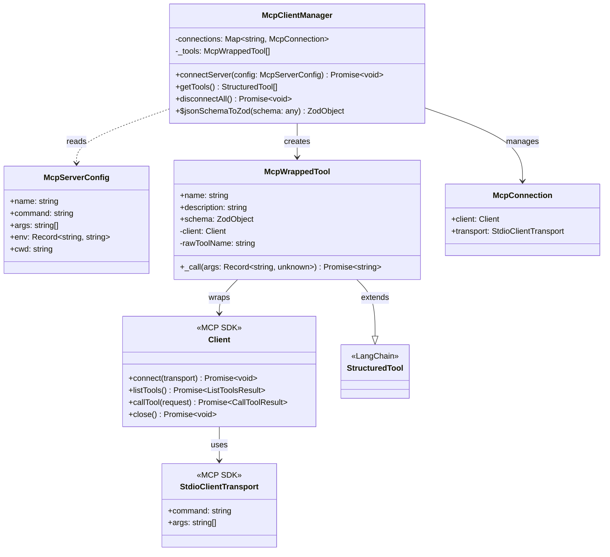
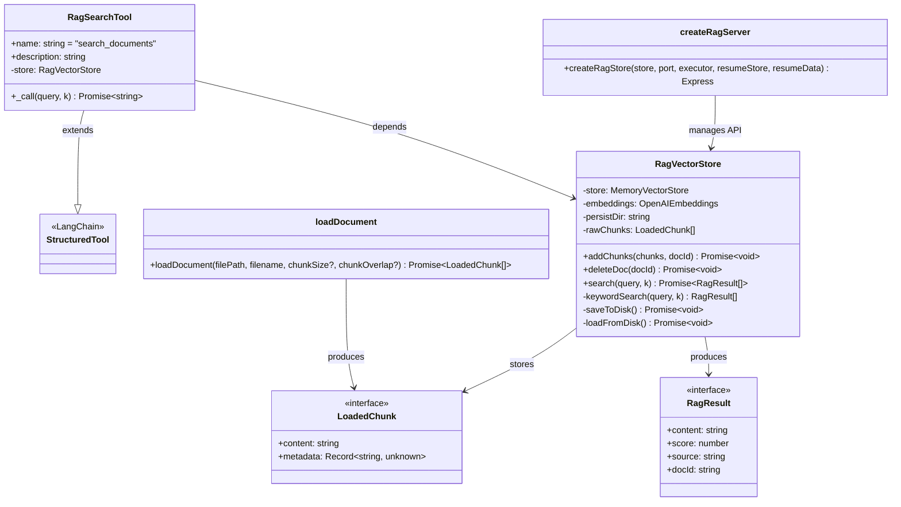
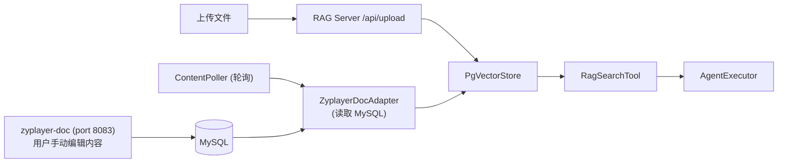
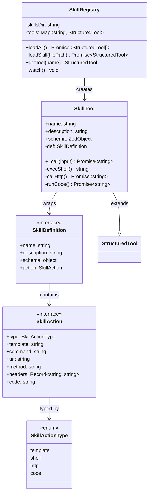
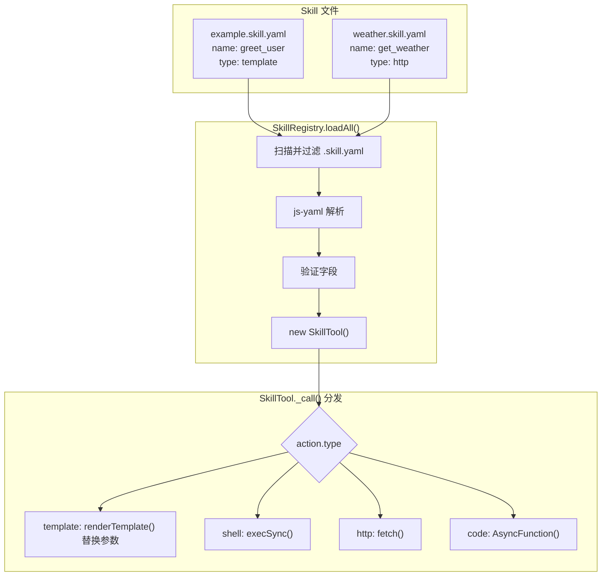
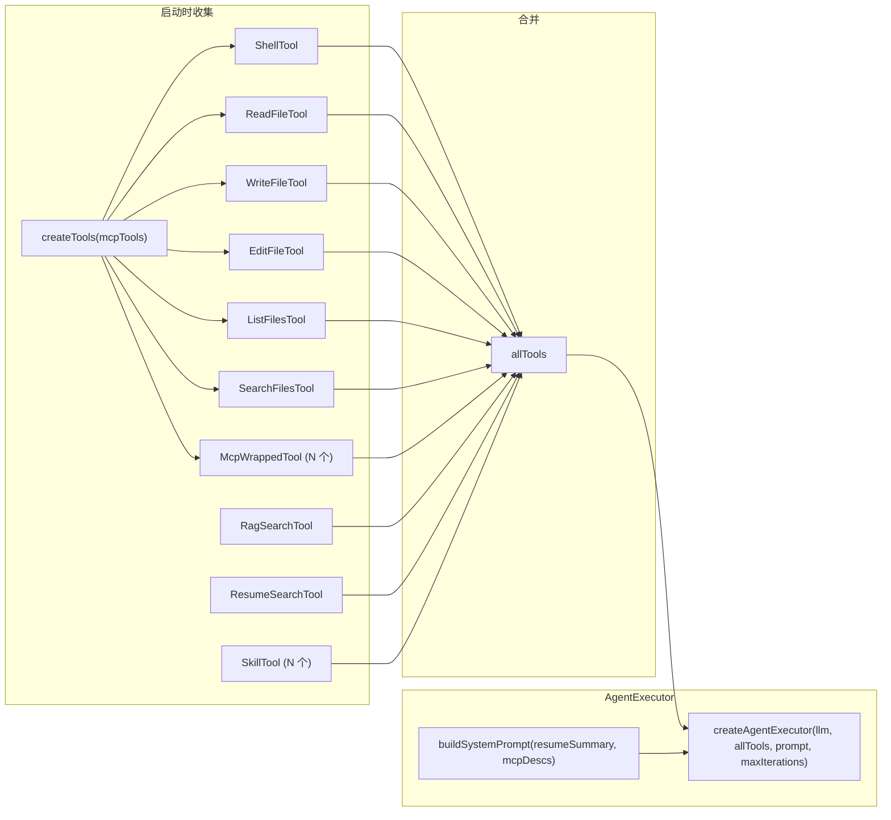
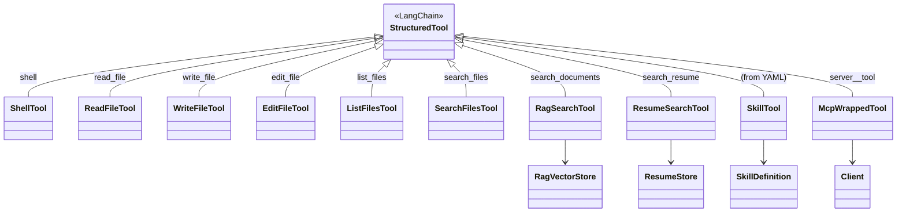
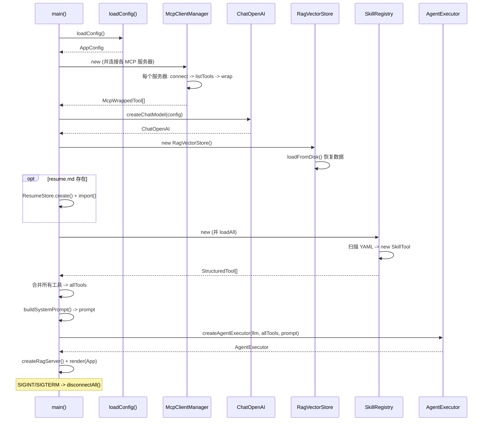
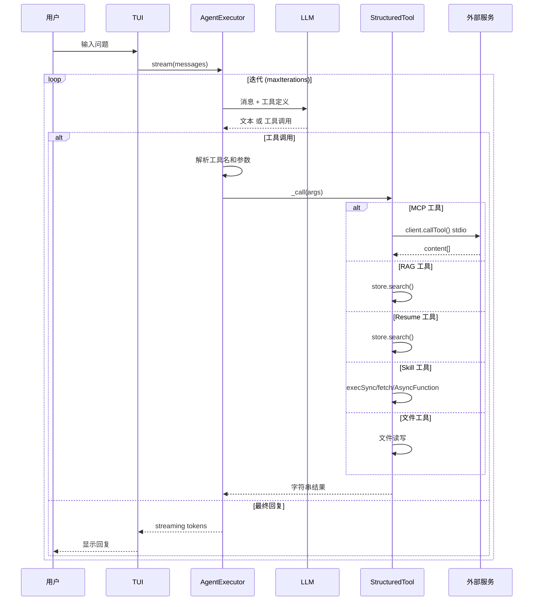

# Navigate Agent 架构 UML 图

> 生成时间: 2026-07-12 | Mermaid v8.8.2+

---

## 1. 整体架构概览



---

## 2. MCP 客户端子系统

### 类图



### JSON Schema → Zod 转换

```
MCP Server listTools()  →  JSON Schema  →  jsonSchemaToZod()
                                                │
                ┌────────────────────────────────┤
                ↓          ↓         ↓          ↓
           z.string()  z.number()  z.boolean()  z.array(z.any())
                ↓          ↓         ↓          ↓
           + .describe() + .default() + .optional()
                ↓
           z.object({ ... })  →  McpWrappedTool.schema
```

---

## 3. RAG 子系统

### 类图



### 数据处理流

```
上传:  User  →  POST /api/upload  →  loadDocument() 分块  →  RagVectorStore.addChunks()  →  持久化到磁盘
搜索:  Agent  →  RagSearchTool._call()  →  similaritySearchWithScore()  →  keywordSearch() 回退  →  结果
恢复:  启动  →  RagVectorStore.loadFromDisk()  →  重新 embed  →  MemoryVectorStore
```

### RAG ↔ zyplayer-doc 集成



---

## 4. Skill 子系统

### 类图



### 加载与执行流程



---

## 5. Agent 工具集成

### 工具注册



### StructuredTool 继承层次



---

## 6. 系统启动序列



---

## 7. 工具调用流程



---

## 图例

| 符号 | 含义 |
|------|------|
| `class` / `<<interface>>` | TypeScript 类 / 接口 |
| `--|>` `extends` | 继承 |
| `-->` | 关联/依赖 |
| `..>` | 创建 |
| `<|--` | 被继承 |
| `{}` 菱形 | 条件分支 |
| `alt/else/end` | 条件选择 |
| `loop/end` | 循环 |
| `opt/end` | 可选块 |

---

> 使用 Mermaid.js 语法，支持 GitHub、VS Code (Mermaid 插件)、GitLab 等渲染器。
