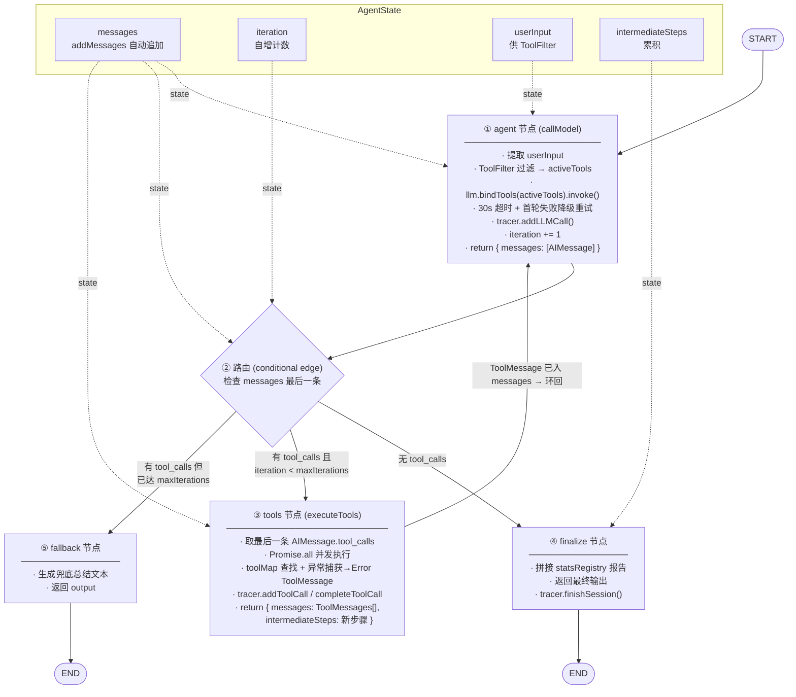
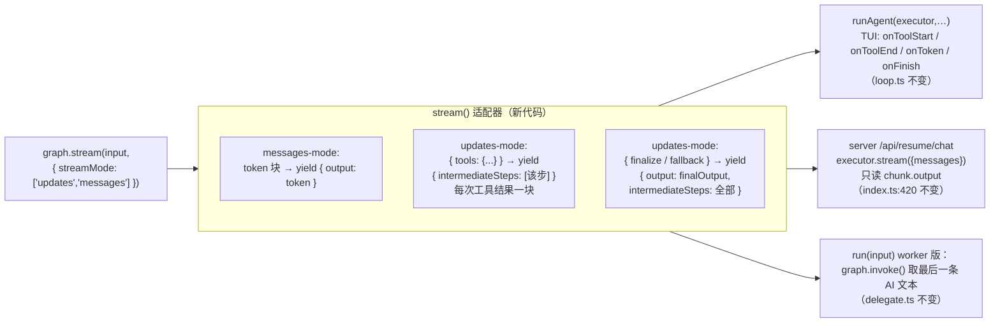

# ReAct → LangGraph 迁移设计（功能平移）

> 目标：用 LangGraph `StateGraph` 替换现有 ReAct 循环，**不改变**任何对外接口。
> 依赖安装：`npm i @langchain/langgraph`

---

## 0. 现状：两条 ReAct 路径与不可破坏的契约

```
┌─ 主循环 ─────────────────────────────────────────────┐
│  index.ts / server-entry.ts                          │
│    createAgentExecutor() → LangChain AgentExecutor   │
│      ├─ TUI: runAgent(executor, input, history, evts)│
│      └─ server: executor.stream({messages})          │
│         （/api/resume/chat 只读 chunk.output）        │
└──────────────────────────────────────────────────────┘

┌─ Worker 循环 ────────────────────────────────────────┐
│  tools/delegate.ts (delegate_task 工具)               │
│    new CustomAgent(...).run(taskText) → string       │
└──────────────────────────────────────────────────────┘
```

**必须平移的契约（两条路径共 2 个）：**

1. `stream({ messages })` → `AsyncGenerator<{ output?, intermediateSteps? }>`，块与 `AgentExecutor.stream()` 兼容
2. `run(input)` → `Promise<string>`（worker 专用）

`src/agent/loop.ts` 的 `runAgent()` / `parseHistory()` / 30s 超时包装 **不用改** —— 它只是消费 stream 块；替换点是 `executor` 本体。

---

## 1. 目标：LangGraph StateGraph

### 1.1 State 定义

```ts
import { Annotation, MessagesAnnotation } from "@langchain/langgraph";

const AgentState = Annotation.Root({
  // 消息链：用 MessagesAnnotation 内置 reducer（追加 + 按 message ID 去重/覆盖/删除）
  // 比手写 concat 更正确 —— concat 跨节点会把整个数组重复一遍。
  // 也可只取单字段: messages: MessagesAnnotation.spec.messages
  ...MessagesAnnotation.spec,

  // 当前迭代轮次（取代 for 循环的 iteration 计数）
  iteration: Annotation<number>({
    reducer: (_, b) => b,      // 覆盖
    default: () => 0,
  }),
  // 原始用户输入（供 ToolFilter 使用；tools/toolFilter 等用闭包捕获，不进 state）
  userInput: Annotation<string>({
    reducer: (_, b) => b,
    default: () => "",
  }),
  // 累积中间步骤（供流式适配器拼 intermediateSteps 块）
  intermediateSteps: Annotation<AgentStep[]>({
    reducer: (left, right) => left.concat(right),
    default: () => [],
  }),
});

// ⚠️ 必须是 .State（运行时 state 对象），不是 typeof AgentState（那是 schema 定义 AnnotationRoot）
type AgentStateType = typeof AgentState.State;
// 节点返回值类型用 .Update；schema 本身只用于 new StateGraph(AgentState)
```

### 1.2 节点与边（核心流程图）



### 1.3 节点伪代码（关键逻辑）

```ts
// ① agent：唯一 LLM 调用点
async function agentNode(state: AgentStateType) {
  const userInput = state.userInput || extractUserText(state.messages);
  // 动态工具过滤（每次迭代重算；为空时降级为全部）
  let activeTools = allTools;
  if (toolFilter && userInput) {
    const filtered = toolFilter.filter(allTools, userInput);
    if (filtered.length > 0) activeTools = filtered;
  }
  const llmWithTools = llm.bindTools(activeTools);

  let response;
  const llmStart = performance.now();
  try {
    response = await llmWithTools.invoke(state.messages, {
      signal: AbortSignal.timeout(30000),
    });
  } catch (err) {
    tracer?.addError(errMsg);
    if (state.iteration === 0) {
      // 首轮降级：去掉工具再试一次
      response = await llm.invoke(state.messages, {
        signal: AbortSignal.timeout(30000),
      });
    } else {
      throw new Error(`Agent loop failed at iteration ${state.iteration + 1}: ${errMsg}`);
    }
  }
  tracer?.addLLMCall(state.iteration, /*...*/);
  return { messages: [response], iteration: state.iteration + 1 };
}

// ② 路由：AgentExecutor 的 `continue/stop` 判定
function route(state: AgentStateType): "tools" | "finalize" | "fallback" {
  const last = state.messages.at(-1);
  const hasToolCalls = !!(last && "tool_calls" in last && last.tool_calls?.length);
  if (!hasToolCalls) return "finalize";
  if (state.iteration >= maxIterations) return "fallback";
  return "tools";
}

// ③ tools：并发执行全部 tool_call
async function toolsNode(state: AgentStateType) {
  const lastAI = state.messages.at(-1) as AIMessage;
  const results = await Promise.all(
    lastAI.tool_calls.map(async (tc) => {
      const toolName = tc.name as string;
      const toolArgs = (tc.args ?? {}) as Record<string, unknown>;
      tracer?.addToolCall(state.iteration, toolName, toolArgs);
      const tool = toolMap.get(toolName);
      if (!tool) {
        return { tc, result: `Tool "${toolName}" not found. Available: ${[...toolMap.keys()].join(", ")}`, success: false };
      }
      try {
        const start = Date.now();
        const result = await tool.invoke(toolArgs);
        tracer?.completeToolCall(result, true, Date.now() - start);
        return { tc, result, success: true };
      } catch (err) {
        const msg = err instanceof Error ? err.message : String(err);
        tracer?.completeToolCall(msg, false, 0);
        return { tc, result: `Error: ${msg}`, success: false };
      }
    }),
  );
  const toolMessages = results.map((r) => new ToolMessage(r.result, r.tc.id as string));
  const steps: AgentStep[] = results.map((r) => ({
    action: { tool: r.tc.name as string, toolInput: (r.tc.args ?? {}) as Record<string, unknown>, log: "" },
    observation: r.result,
  }));
  return { messages: toolMessages, intermediateSteps: steps };
}

// ④ finalize：无工具调用 → 最终答案（含 stats）
async function finalizeNode(state: AgentStateType) {
  let output = extractText((state.messages.at(-1) as AIMessage).content);
  if ((toolStatsRegistry?.getTotalCalls() ?? 0) > 0) {
    const report = toolStatsRegistry!.getReport();
    if (report) output += "\n\n" + report;
  }
  tracer?.finishSession();
  return { finalOutput: output };
}

// ⑤ fallback：迭代用尽兜底（对应原 maxIterations 分支）
async function fallbackNode(state: AgentStateType) {
  const fallback = `I've used all ${maxIterations} iterations. Here's what I know:\n${state.intermediateSteps
    .map((s) => `- ${s.action.tool}: ${String(s.observation).slice(0, 200)}`)
    .join("\n")}`;
  return { finalOutput: fallback };
}
```

### 1.4 编译图

```ts
const workflow = new StateGraph(AgentState)
  .addNode("agent", agentNode)
  .addNode("tools", toolsNode)
  .addNode("finalize", finalizeNode)
  .addNode("fallback", fallbackNode)
  .addEdge(START, "agent")
  .addConditionalEdges("agent", route, ["tools", "finalize", "fallback"])
  .addEdge("tools", "agent")   // ← 这就是 ReAct 的循环

  .addEdge("finalize", END)
  .addEdge("fallback", END);

const graph = workflow.compile();
```

---

## 2. 流式适配器：把 LangGraph chunk 翻译回 `{ output?, intermediateSteps? }`

这是**功能平移的关键**。LangGraph 的 `stream()` 产出的块和 AgentExecutor 不同，必须包一层，让 `runAgent` 和 server 一行不改。



```ts
// 兼容 AgentExecutor.stream() 的包装
async function* stream({ messages }: { messages: BaseMessage[] }) {
  const input: typeof AgentState.State = {
    messages: [new SystemMessage(systemPrompt), ...messages],
    userInput: extractUserText(messages),
    iteration: 0,
    intermediateSteps: [],
  };
  for await (const chunk of graph.stream(input, { streamMode: ["updates", "messages"] })) {
    // 多 streamMode 时每个 chunk 是 [mode, value] 元组，先解构再按 mode 分流
    const [mode, value] = chunk as [string, any];

    if (mode === "messages") {
      // messages-mode 的 value 是 [messageChunk, metadata]
      const [msgChunk, metadata] = value;
      if (metadata?.langgraph_node === "agent") {  // 只收 agent 节点的 token
        const token = msgChunk?.content ?? "";
        if (token) yield { output: String(token) };
      }
      continue;
    }

    if (mode === "updates") {
      // updates-mode 的 value 是 { 节点名: partial update }
      if (value.tools) {
        for (const step of value.tools.intermediateSteps ?? []) {
          yield { intermediateSteps: [step] };
        }
      } else if (value.finalize || value.fallback) {
        const u = value.finalize ?? value.fallback;
        yield { output: u.finalOutput, intermediateSteps: u.intermediateSteps ?? [] };
      }
    }
  }
}
```

> 说明：
> - `messages-mode` 让 token 逐块吐出，`runAgent` 的 `onToken`（TUI 打字机效果）继续工作。
> - `updates-mode` 的 `tools` 节点更新正好对应"每次工具结果 yield 一块 intermediateSteps"，与 `custom-loop.ts:234` 行为一致。
> - 若嫌双 mode 复杂，可只用 `streamMode: "updates"` —— 代价是 `output` 只会在结束时一次性吐出（TUI 失去打字机效果），但语义仍等价。

### `run()`（worker 版，供 delegate.ts）

```ts
async function run(input: string): Promise<string> {
  tracer?.startSession(`[worker] ${input}`);
  const result = await graph.invoke({
    messages: [new SystemMessage(workerPrompt), new HumanMessage(input)],
    userInput: input,
    iteration: 0,
    intermediateSteps: [],
  });
  const last = result.messages.at(-1);
  return extractText((last as AIMessage).content);
}
```

---

## 3. 现有逻辑 → LangGraph 映射表（重构核对清单）

| 现有逻辑 | 原位置 | LangGraph 对应 |
|---|---|---|
| 组装 System + 历史 messages | `loop.ts runAgent` / `custom-loop.ts:84` | 适配器 `stream()` 入参组装 |
| ToolFilter 动态过滤（空则降级全部） | `custom-loop.ts:111-126` | `agentNode` 内闭包执行 |
| LLM 推理 + 30s 超时 | `custom-loop.ts:131-136` | `agentNode` 内 `AbortSignal.timeout(30000)` |
| 首轮失败降级重试（去工具再试） | `custom-loop.ts:143-153` | `agentNode` 的 catch 分支（用 `state.iteration === 0` 判定） |
| `tracer.addLLMCall` | `custom-loop.ts:160-168` | `agentNode` 返回前 |
| 无 tool_calls → 最终答案 | `custom-loop.ts:171-187` | 路由 `route()` → `finalizeNode` |
| 最终答案附 statsRegistry 报告 | `custom-loop.ts:178-183` | `finalizeNode` |
| 有 tool_calls → AIMessage 入消息链 | `custom-loop.ts:192` | `agentNode` 的 `return { messages: [response] }`（addMessages 追加） |
| 并发执行全部工具 + 异常捕获 | `custom-loop.ts:195-222` | `toolsNode`（Promise.all + try/catch） |
| 工具不存在 → Error ToolMessage | `custom-loop.ts:204-208` | `toolsNode` 的 `toolMap.get` 分支 |
| 每条结果入消息链 + 单步 yield | `custom-loop.ts:225-235` | `toolsNode` 返回 ToolMessages → 适配器 yield 单块 |
| `tracer.completeToolCall` | `custom-loop.ts:232` | `toolsNode` 每条结果后 |
| maxIterations 兜底总结 | `custom-loop.ts:238-247` | 路由 → `fallbackNode` |
| `tracer.finishSession` | `custom-loop.ts:184` | `finalizeNode` |
| `run()` worker 同步路径 | `custom-loop.ts:254-358` | `run()` 用 `graph.invoke()` |
| `run()` 迭代超限 → LLM 总结 | `custom-loop.ts:336-357` | 可选：在 `fallbackNode` 里复用同样的总结 prompt |
| 循环本身 | `for (iteration…)` | `tools → agent` 边（图天然循环）|
| `AgentExecutor.stream()` 块格式 | — | 适配器 `stream()` |

---

## 4. 关键注意事项（重构时容易踩的坑）

1. **State 里的东西要可序列化**：`toolMap`、`toolFilter`、`llm`、`tracer`、`toolStatsRegistry`、`maxIterations` 用**闭包捕获**，不要放进 `Annotation` state。
1b. **`MessagesAnnotation` 需要 `@langchain/langgraph` ≥ 0.2.25**（最新 1.4.x 都有）；它自带 `messages` 字段与 upsert reducer，`...MessagesAnnotation.spec` 展开后 `messages` 已就绪，**不要再手写 concat reducer**，否则两个 `messages` 定义会冲突/重复。
2. **`addMessages` 等价 reducer**：`messages` 必须用 concat 风格 reducer（追加），否则每条消息会覆盖上一条，循环直接断掉。
3. **路由的迭代判定**：`agentNode` 里 `iteration += 1`，路由读的是**加完后的值**，否则 maxIterations 边界会差 1。
4. **30s 超时是 `runAgent` 的 `Promise.race` + LLM invoke 双重**：图里 LLM invoke 仍保留 `AbortSignal.timeout`；外层 `runAgent` 的超时包装不用动。
5. **server 直连 `executor.stream({messages})`**（不经 runAgent）：适配器必须接受 `{ messages }` 作为唯一入参、逐块读 `output` —— 见 `src/server/index.ts:420`。
6. **worker 与主循环差异**：worker 不传 toolFilter（`delegate.ts` 里是 `undefined`），也没有 statsRegistry 拼接。共享图即可——这两个依赖本来就是可选的，不注入就自动跳过。
7. **`tool_calls` 判空**：`response.tool_calls` 可能为 `[]` 或 `undefined`，路由要用 `last.tool_calls?.length` 统一判空（原代码 `custom-loop.ts:171` 是 `!toolCalls || toolCalls.length === 0`）。
8. **降级重试只发生在首轮**：`state.iteration === 0`，与原 `iteration === 0` 语义一致。
9. **LangGraph 依赖**：需新增 `@langchain/langgraph`；`@langchain/core` 版本须 ≥0.3（项目已是）。
