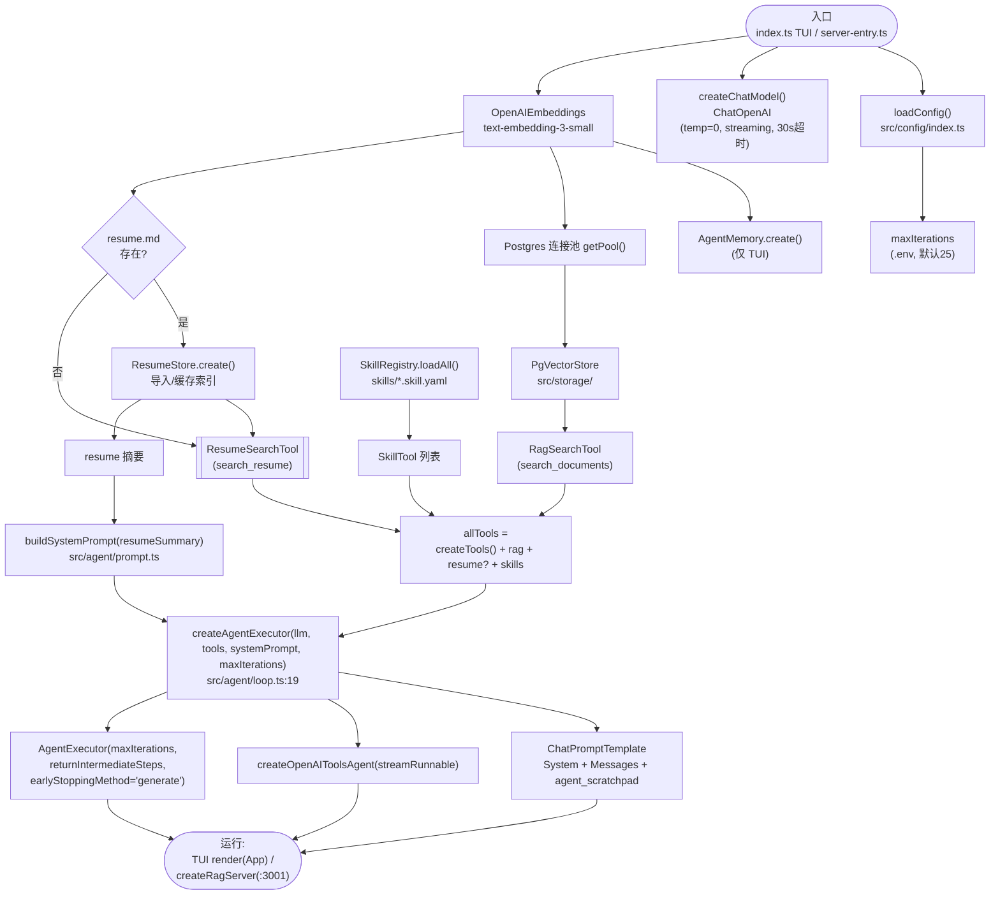
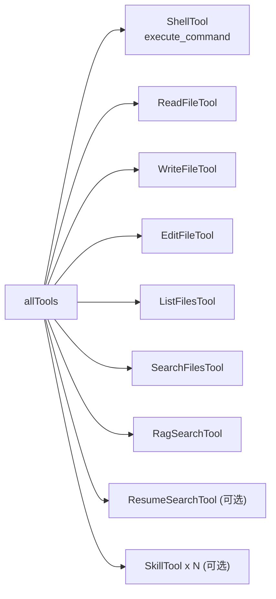
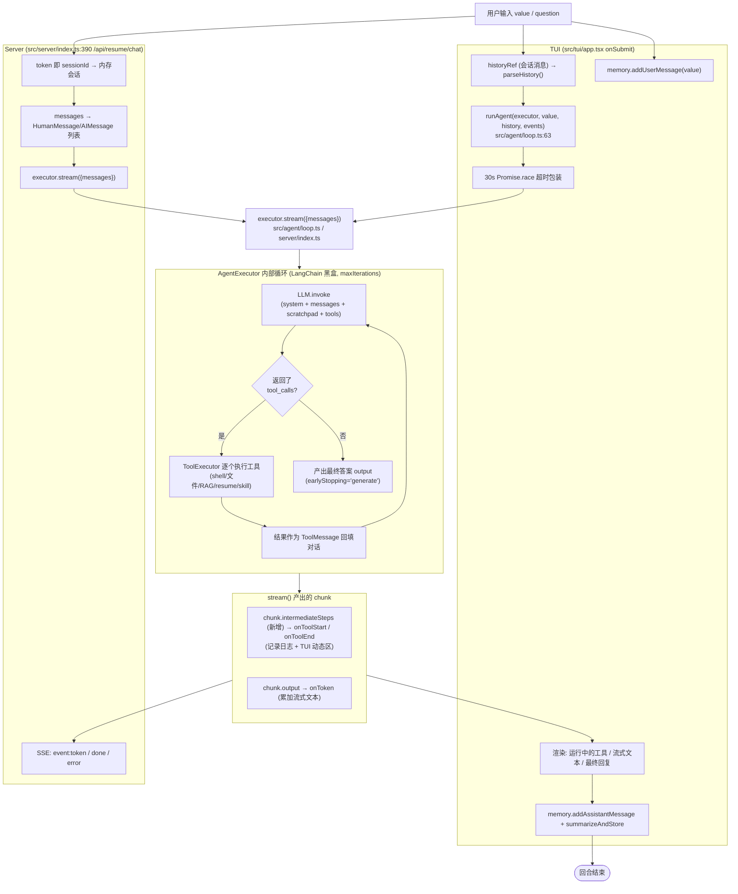
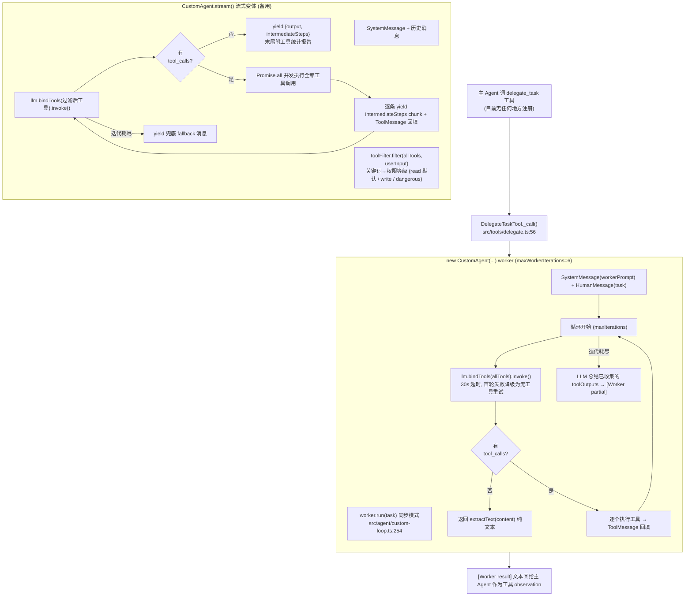
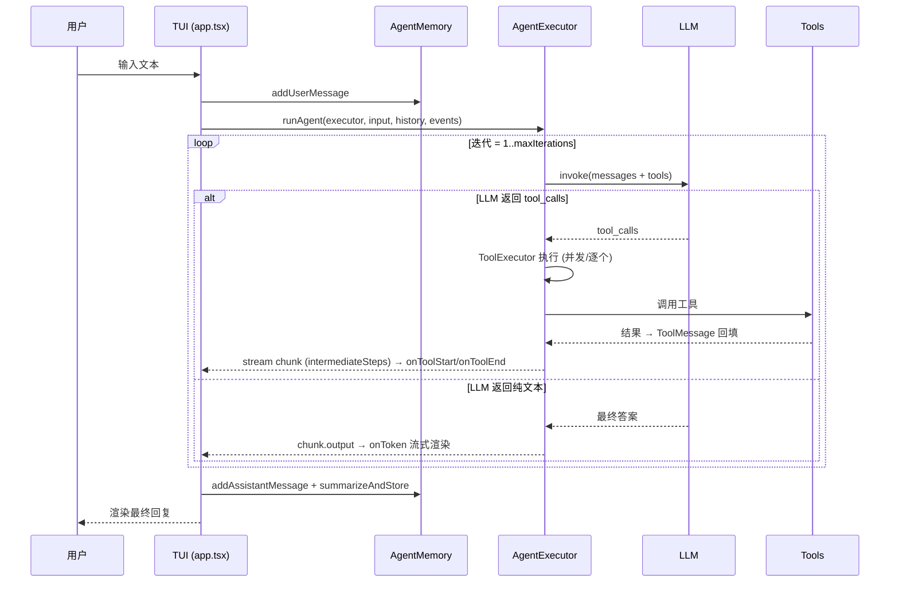

# Navigate Agent ReAct 流程

> 扫描自当前代码 (2026-08-07) | Mermaid

## 0. 结论速览

项目里实际存在 **两条 ReAct 路径**,只有一条在运行:

| 路径 | 代码 | 是否接线 | 说明 |
|---|---|---|---|
| **主路径** | `loop.ts` → LangChain `AgentExecutor` + `createOpenAIToolsAgent` | ✅ TUI & Server 都在用 | 黑盒循环,产出的 chunk 与 `runAgent`/TUI/SSE 对接 |
| **手写路径** | `custom-loop.ts` `CustomAgent` + `delegate.ts` `DelegateTaskTool` | ⚠️ 未接线 | `delegate_task` 未在 `createTools()`/入口注册,目前是死代码;`ToolFilter` 也仅在这里生效 |

另有一个差异点:CLAUDE.md 声称"所有工具都被 `PermissionWrapper` 包装",但 `src/tools/registry.ts` 的 `createTools()` 返回的是**裸工具**(`new ShellTool()` 等,未包 `PermissionWrapper`),`ToolFilter` 在主路径里也没被调用 → 实际运行时 LLM 能看到全部工具、无动态权限过滤。

---

## 1. 装配流程(进程启动时一次)



工具集合明细(`createTools()`,`src/tools/registry.ts`):



---

## 2. 主路径 ReAct 循环(实际运行)

TUI 输入 → `runAgent()`;HTTP 请求 → `/api/resume/chat`。两条路最终都调用同一个 `executor.stream({messages})`。



主循环代码位点:`src/agent/custom-loop.ts:103-248` 里注释描述的循环结构与 LangChain `AgentExecutor` 一致(Think → Act → Observe),区别仅是前者手写、后者黑盒。

---

## 3. 手写路径 CustomAgent(当前未接线)

`src/agent/custom-loop.ts` 的手写 ReAct 循环,唯一调用方是 `src/tools/delegate.ts` 的 `DelegateTaskTool`(子任务委派 worker)。`delegate_task` 未注册进 `createTools()`,所以此路径目前不会触发。



---

## 4. 权限 / 过滤基础设施(存在但主路径未生效)

```mermaid
flowchart LR
    PERM["PermissionWrapper 装饰器<br/>src/tools/permission.ts<br/>permission: read/write/dangerous<br/>+ 统计 + 限流/熔断(未启用)"] --> RAW["原始 StructuredTool"]
    FILTER["ToolFilter<br/>src/tools/tool-filter.ts<br/>关键词 → 最低权限等级"] -.只在 custom-loop.ts 调用.-> PERM

    RAW2["createTools()<br/>返回裸工具 (new ShellTool() ...)<br/>未包 PermissionWrapper"] -.实际.-> EXEC2["AgentExecutor 主路径<br/>工具全部暴露, 无动态过滤"]
```

> ⚠️ 与 CLAUDE.md 描述不符:文档称所有工具均被 `PermissionWrapper` 包装、`ToolFilter` 动态限制可见工具,但当前 `registry.ts` 没有包装,主路径也没接入 `ToolFilter`。要启用需在 `createTools()` 里 `new PermissionWrapper(new ShellTool(), "dangerous")` 并把过滤接入 `createAgentExecutor` 或改走 `CustomAgent.stream()`。

---

## 5. 一次完整对话的生命周期(TUI 视角)


